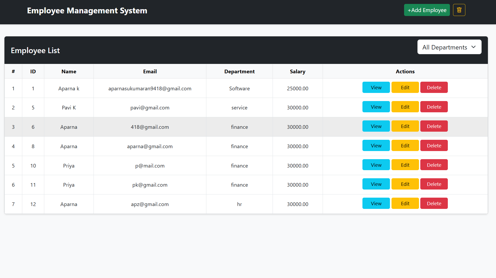
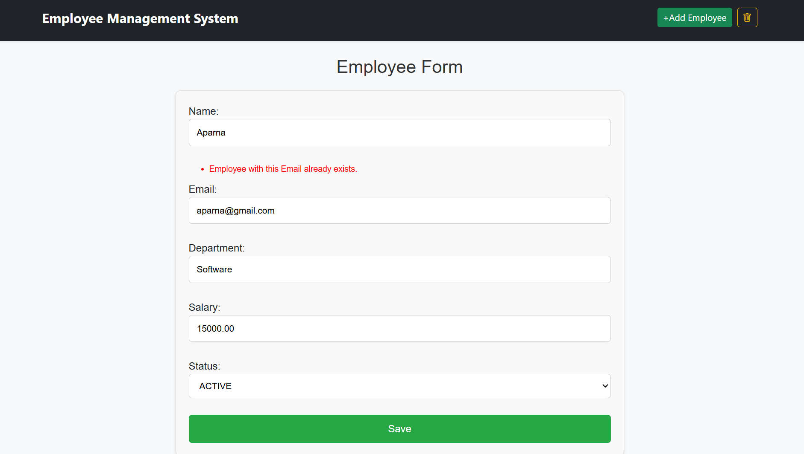
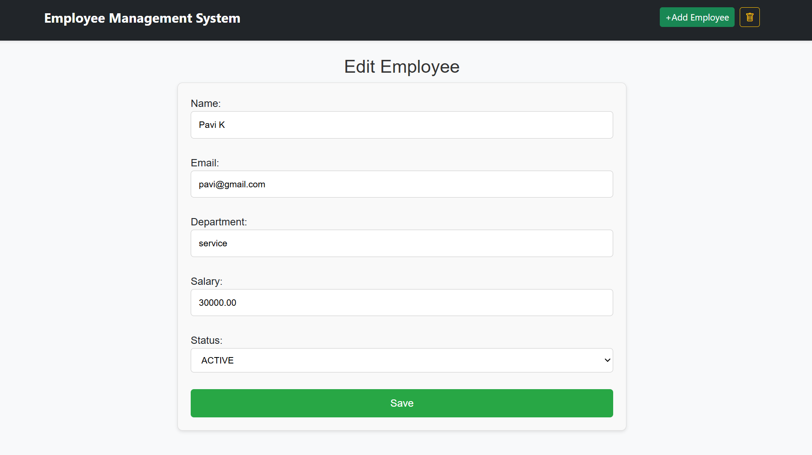
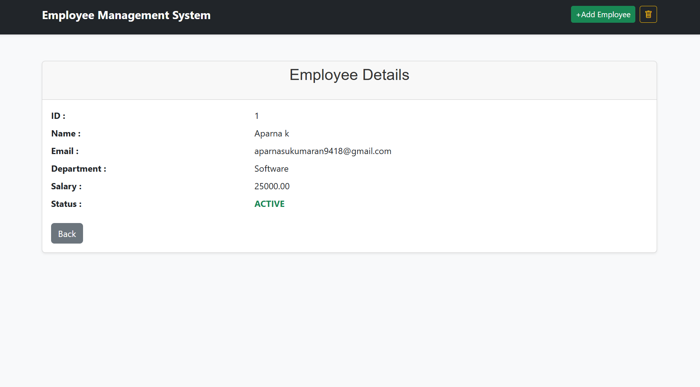

# Employee Management System

A Django-based Employee Management System implementing:

- CRUD operations
- Soft delete (Active / Inactive employees)
- Hard delete from trash
- Restore employee
- Department filter
- Bootstrap responsive UI
- Success alerts and validations

## Features

- Add employee
- Update employee
- View employee details
- Soft delete (mark inactive)
- Trash module
- Restore employee
- Permanent delete
- Department-based filtering
- Responsive design

## Tech Stack

- Python
- Django 4.1
- SQLite
- Bootstrap 5

## Screenshots

### Employee List


### Add Employee


### Edit Employee


### Fetch Employees By ID 


### Inactive Employees (Trash)


## How to Run

```bash
python -m venv venv
venv\Scripts\activate
pip install django
python manage.py migrate
python manage.py runserver
